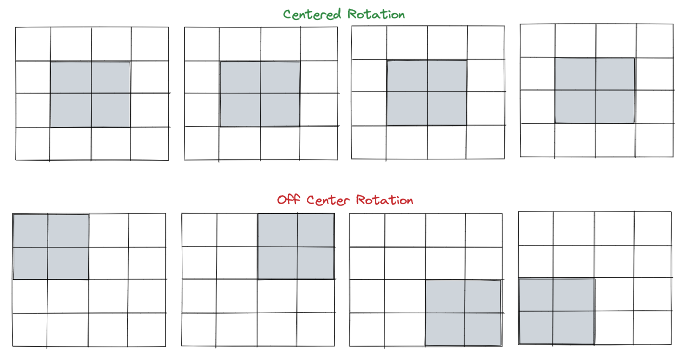

# Lo-Fi Tetris

## Overview
This was the first project for the Software Engineering Immersive course with GA. We were given a timeline of one week to pick a game from a list of options then re-create it, and I chose Tetris. I found the solo project to be an incredible learning experience in brainstorming, designing, then executing a project from start to finish, and I learned many valuable lessons along the way.

You can find the deployed version of my game here: [Lo-Fi Tetris](https://jacqizee.github.io/Lo-Fi-Tetris/)


## Navigation

* [Brief](#the-brief)
* [Technologies Used](#technologies-used)
* [Controls & Features](#controls-&-features)
* [Instructions](#instructions)
* [Approach](#approach)
* [Reflection](#reflection)
* [Future Features](#future-features)
* [Credits](#credits)

## The Brief

**Timeframe:**
* 7 days

**General Project Brief:**
* Design logic for winning & visually display which player won
* Use JavaScript for DOM manipulation
* Use semantic markup for HTML and CSS

**Tetris-Specific Brief:**
* The game should stop if a Tetrimino fills the highest row of the game board
* The player should be able to rotate each Tetrimino about its own axis
* If a line is completed it should be removed and the pieces above should take its place

## Technologies Used
**Languages:**
* JavaScript (ES6+)
* HTML5 & HTML5 Audio
* CSS3

**Dev Tools:**
* VSCode
* Eslint
* Git
* GitHub
* Google Fonts
* Google Chrome Dev Tools

## Controls & Features
* Start Button
* Key Up - Rotates the Tetromino
* Key Down - Lowers Tetromino
* Key Left/Right - Moves the Tetromino Left/Right
* Reset Button
* Audio & Audio Controls
* Persistent High Score Using Local Storage
* Speed Increases as Player Levels Up

## Instructions
* Tetris is a puzzle game where the player has to fit different shaped blocks (called Tetriminos) together so that they make a complete line across the playing board. Once a line is achieved it is removed from the game board and the player's score is increased
* The player can move the Tetriminos left and right and rotate them clockwise in 90º increments
* The aim of the game is to get as many points as possible before the game board is filled with Tetriminos

## Approach
Selecting Tetris as my game of choice for the project definitely put me way outside my comfort zone, but I selected it to push myself to see if I could rise to the daunting challenge within a week. I personally also really enjoy playing Tetris, so was particularly drawn and eager to recreate it.

### Planning: Wireframing and Pseudocode

Before jumping into coding, I played several different versions of Tetris online to remind myself of the gameplay and to note features available that I would want to replicate for my game. From there, I drew out a wireframe to map the different semantic and non-semantic HTML elements, then moved into pseudocoding how I thought I should approach the problem.


Despite itching to jump into coding, I spent the entire first day on pseudocode to plan out my approach to the project, as I felt if I skipped/rushed this step I was bound to hit many roadblocks. Initally I mapped out that I would need:
* An interval which lowers the active tetromino by one row every second or so. The interval would need to check if the piece could be lowered, and if not i.e. reaching the bottom of the grid or another tetromino piece, freeze the tetromino in place.
* To randomly generate a tetromino and be able to move it left, right, and down as it falls down the board
* To clear rows when full, shifting all elements above the row down
* And to end the game when there is no room for a new tetromino to drop

Once I had mapped out a plan for how I planned to approach each item listed, I allowed myself to get cracking on the coding.

### Grid Creation

To start, I wrote up the HTML for the game based off my wireframe, then used JavaScript and DOM manipulation to both create the main grid and mini grid for the game, storing each div created as a cell within an array. Afted adding a sprinkling of basic CSS, I was ready to start writing functions.


```
function createGrid(grid, cellCount, cellArray) {
  for (let i = 0; i < cellCount; i++) {
    const cell = document.createElement('div')
    grid.appendChild(cell)
    cell.dataset.index = i
    cellArray.push(cell)
  }
}
  
createGrid(mainGrid, mainCellCount, mainCells)
createGrid(nextGrid, nextCellCount, nextCells)
```

### Creating and Generating Tetronimos

To create and generate tetronimos in JavaScript, I created a class that would allow me to easily create objects and assign values for their different attributes. Initially, I had a single array that I used to store the Tetronimos, and would access each Tetronimo via a randomly generated number from 0 to 6.

```
class Tetromino {
  constructor(startingPosition, shape) {
    this.currentPosition = startingPosition,
    this.startingPosition = startingPosition,
    this.nextPosition = [],
    this.active = shape + '-active',
    this.inactive = shape + '-paused'
  }
}

const tetrominoO = new Tetromino([4, 5, 14, 15], 'red')
..
...
const tetrominoI = new Tetromino([3, 4, 5, 6], 'violet')
const allTetrominos = [tetrominoO, tetrominoL, tetrominoJ, tetrominoT, tetrominoZ, tetrominoS, tetrominoI]

nextShape === null ? currentTetro = allTetrominos[Math.floor((Math.random() * 7))] : currentTetro = nextTetro
nextShape = allTetrominos[Math.floor((Math.random() * 7))]
```

Later on, I removed this static array and instead generated a new tetronimo object and re-assigned it to `currentTetro`. This was cleaner than re-using the same objects, and saved me from having to re-set any object values. I used a switch statement function as it was more readable and cleaner than multiple if .. else statements. 

```
  function generateTetro() {
    switch (Math.floor((Math.random() * 7))) {
      case 0:
        return new Tetromino([4, 5, 14, 15], 'o')
      case 1:
        return new Tetromino([4, 14, 24, 25], 'l')
      case 2:
        return new Tetromino([5, 15, 24, 25], 'j')
      case 3:
        return new Tetromino([4, 13, 14, 15], 't')
      case 4:
        return new Tetromino([4, 5, 15, 16], 'z')
      case 5:
        return new Tetromino([4, 5, 13, 14], 's')
      case 6:
        return new Tetromino([3, 4, 5, 6], 'i')
    }
  }

nextTetro === null ? currentTetro = generateTetro() : currentTetro = nextTetro
nextTetro = generateTetro()
```

### Dropping the Tetronimo

To drop a tetronimo and move it down the screen, I used a setTimeout interval. In contrast to setInterval, I knew setTimeout would allow me to more easily update the speed of the tetronimo drop/interval as the player levels up. Outside of just moving the active tetronimo, this interval was also where a lot of the heavy lifting was executed: 
* Generating new tetronimos
* Generating the upcoming tetronimo and displaying it in the mini grid
* Checking whether the game should end (if no space for a new tetronimo)
* Checking if any lines needed to be cleared when the tetronimo reaches the bottom

To know which tetronimo to move (or whether to generate and drop a new one), I classed tetronimo cells as either 'active' or 'paused'. At the start of the interval if active cells were present, that would signal to move that shape down a row. If active cells were absent, then it would signal that we needed to generate a new shape and drop it from the top. Checks in place would be validated throughout.

### Tetronimo Horizontal Movement

To allow the user to be able to move tetronimos horizontally, I had to be conscious of was movement that would wrap the tetronimo on the left or right edges of the grid, and any movement into an existing tetronimo. To prevent this, I used if .. statements that blocked movement left/right if the shape was at all present in the left/right-most column, or if its new position already contains a paused cell.

```
function moveTetromino(arrowDirection) {
    if (currentTetro.nextPosition.every(index => index < mainCellCount)) {
      removeTetromino()
      if (arrowDirection === 'ArrowDown') {
        currentTetro.currentPosition.map(index => index + mainWidth)
        if (!currentTetro.currentPosition.map(index => index + mainWidth).some(index => mainCells[index].className.includes('paused'))) {
          currentTetro.currentPosition = currentTetro.nextPosition
        }
      }
      if (arrowDirection === 'ArrowRight' && !currentTetro.currentPosition.some(index => (index % mainWidth) === 9)) {
        if (!currentTetro.currentPosition.map(index => index + 1).some(index => mainCells[index].className.includes('paused'))) {
          currentTetro.currentPosition = currentTetro.currentPosition.map(index => index + 1)
        }
      }
      if (arrowDirection === 'ArrowLeft' && !currentTetro.currentPosition.some(index => (index % mainWidth) === 0)) {
        if (!currentTetro.currentPosition.map(index => index - 1).some(index => mainCells[index].className.includes('paused'))) {
          currentTetro.currentPosition = currentTetro.currentPosition.map(index => index - 1)
        }
      }
      addTetromino()
    }
  }

```

### Tetronimo Rotation

Tetronimo rotation was by far the most challenging part of this project to tackle. I originally saw two ways to achieve this either by:
  1. hard coding each tetronimo's rotations and then rotating the pieces by keeping track of which rotated position the piece was in, or
  2. creating a 'matrix' of some sort that tracks where a tetronimo is located, then rotating all active cells by a set amount

I decided on method 2, since it felt more challenging but would allow me to rotate all tetronimo shapes with the same function, rather than having to treat each piece differently. Rotation definitely challenged me in many ways, I had to account for a lot of variables: collision with the walls/bottom, collision with other pieces, and, eventually, centering a piece within the matrix to rotate it about a center axis.

One issue I had was addressing rotating about a centered axis for pieces, as I had originally rotated from the corner edge. I didn't realize that this would shift pieces down a row or two with each full rotation, which impacted the gameplay quite a bit! Tetronimos would reach the bottom much faster when rotated, while centered pieces did not:



To address this, I had to center each tetronimo within the matrix. If there were two or more empty rows/columns in a matrix, the piece would be shifted over one or two rows/columns in the matrix:

```
// Vertically Centering Tetromino in Rotation Array to Prevent Piece Shift Right
    let rotationArrayBase = [lowestColumn, lowestColumn + 1, lowestColumn + 2, lowestColumn + 3]
    if (rotationArrayBase[0] > mainWidth - 1 && !rotationArrayBase.map(index => index + mainWidth * 2).some(index => mainCells[index].className.includes('active'))) {
      if (rotationArrayBase[0] > mainWidth * 2 - 1 && !rotationArrayBase.map(index => index + mainWidth).some(index => mainCells[index].className.includes('active'))) {
        rotationArrayBase = rotationArrayBase.map(index => index - mainWidth * 2)
      } else { 
        rotationArrayBase = rotationArrayBase.map(index => index - mainWidth)
      }
    }

    // Horizontally Centering Tetromino in Rotation Array to Prevent Piece Shift Down
    const columnFour = [rotationArrayBase[3], rotationArrayBase[3] + mainWidth, rotationArrayBase[3] + mainWidth * 2, rotationArrayBase[3] + mainWidth * 3]
    if (rotationIndex[0] > 0 && rotationIndex[3] < 9 && !columnFour.some(index => mainCells[index].className.includes('active'))) {
      rotationArrayBase = rotationArrayBase.map(index => index - 1)
    }
```

Then, I mapped the new rotated position for the piece, shifting the piece if it would collide with any walls or the floor, as well as any fixed pieces to achieve rotation.

```
// Update Current Position to Rotated Position
    for (let i = 0; i < rotationArray.length; i++) {
      if (rotationArray[0].includes(tempPosition[i])) {
        tempPosition[i] = rotatedArray[0][rotationArray[0].indexOf(tempPosition[i])]
      } else if (rotationArray[1].includes(tempPosition[i])) {
        tempPosition[i] = rotatedArray[1][rotationArray[1].indexOf(tempPosition[i])]
      } else if (rotationArray[2].includes(tempPosition[i])) {
        tempPosition[i] = rotatedArray[2][rotationArray[2].indexOf(tempPosition[i])]
      } else if (rotationArray[3].includes(tempPosition[i])) {
        tempPosition[i] = rotatedArray[3][rotationArray[3].indexOf(tempPosition[i])]
      }
    } tempPosition.sort((a, b) => a - b)

    // Prevent Rotation Beyond Bottom of Grid
    if (tempPosition.some(index => index > mainCellCount)) {
      if (tempPosition.some(index => index > mainCellCount + mainWidth)) {
        tempPosition = tempPosition.map(index => index - (mainWidth * 2))
      } else {
        tempPosition = tempPosition.map(index => index - mainWidth)
      }
    }

    // Prevent Rotation if Paused Piece in the Way
    if (!tempPosition.some(index => mainCells[index].className.includes('paused'))) {
      currentTetro.currentPosition = tempPosition
    } else if (!tempPosition.some(index => mainCells[index + 1].className.includes('paused'))) {
      currentTetro.currentPosition = tempPosition.map(index => index + 1)
    } else if (!tempPosition.some(index => mainCells[index - 1].className.includes('paused'))) {
      currentTetro.currentPosition = tempPosition.map(index => index - 1)
    } else if (!tempPosition.some(index => mainCells[index + 1].className.includes('paused'))) {
      currentTetro.currentPosition = tempPosition.map(index => index + 2)
    } else if (!tempPosition.some(index => mainCells[index - 1].className.includes('paused'))) {
      currentTetro.currentPosition = tempPosition.map(index => index - 2)
    }

    addTetromino()
```

### Line Clear

To clear lines when full, I iterated through each row from top to bottom, checking if every cell in a row has a class name of 'paused', if yes, then I knew this was a line to be cleared. I used a while loop to keep clearing lines until all full lines were cleared, with each row inheriting the class names of the row above it.

```
// Iterate through Array of Rows until all Full Rows are Cleared and Shifted, Top to Bottom
for (let row = mainHeight - 1; row > 0; row--) {
  while (gridRows[row].every(cell => cell.className.includes('paused'))) {
    audioLineClear.play()
    let currentRow = row
    while (currentRow > 0) {
      for (let column = 0; column < mainWidth; column++) {
        gridRows[currentRow][column].className = gridRows[currentRow - 1][column].className
      }
      currentRow -= 1
    }
```

The score is then incremented with a multiplier if multiple lines are cleared at once, and the player's level is increased if they meet or exceed the score threshold, which then increases the interval speed at which pieces fall.

```
// Increase Player Score, the More Lines Cleared at Once, the More Points Scored
playerScore += 50 * multiplier
multiplier++
playerLines += 1
levelCheck()
updateSpans()

----

function levelCheck() {
  if (playerScore >= pointsToLevel) {
    playerLevel++
    audioLevelUp.play()
    pointsToLevel += 500
    intervalSpeed *= 0.90
  }
}
```

### Game End

Game end was handled by the releaseTetronimo function. This function checks if there is space for a tetronimo to be released and if not, it adds the last tetronimo piece then exits out of the function interval, effectively ending the game. It then displays a modal with the final score, and updates the local high score if the achieved score is higher.

```
if (currentTetro.startingPosition.some(index => mainCells[index].className.includes('paused'))) { // Game Over
  audioGameOver.play()
  currentTetro.currentPosition.forEach(index => mainCells[index].classList.add(currentTetro.active))
  gamePause()
  if (playerScore > highScore) {
    localStorage.setItem('highscore', playerScore)
    highScoreSpan.innerHTML = playerScore
    highScoreMsg.style.display = 'block'
  }
  modalContainer.style.display = 'block'
  startButton.innerHTML = 'Replay'
  return
}
```

## Reflection

### Challenges

The greatest challenge of this project was handling tetronimo rotation and thinking through the logic of how to create working functions. Since this was my first large project involving JavaScript, HTML, and CSS, I found I needed to allocate my time wisely to ensure I was tackling key problems for game function (like piece rotation or line clearing), rather than letting myself get distracted with styling or small features like music or theming/styling.

### Key Learnings

This project helped put to practice several different element of coding, such as using classes, switch statements, control flow, and manipulating the DOM to create and update different elements. I found it very enjoyable to dig away and tackle problems piece by piece, ultimately creating a project I am quite proud of! The satisfaction of seeing all the different functions piece together to make a functional game was very rewarding.

I also learned a lot about the importance of planning and pseudocode. I found that sometimes I would get stuck on a problem and try to tackle it right away, when really I could have benefitted from taking a step away from the code for a moment to think through the logic of a workable solution, then moving on to writing the code. 

## Future Features

If I had more time, these are the features I would have loved to incorporate next:
* Hard Drop for Tetronimos - this is a common feature in Tetris that I certainly do miss in my game. My approach would be to check the columns the current shape is in, then find which row has the highest paused cell. From there, I would lower the current shape to just above that row by adding to the currentPosition array
* Counter-Clockwise Rotation - I have most of the checks in place already with my current rotation function, I think if I had time I would have allowed for rotation both directions
* Color-Blind Mode - More of a styling/DOM manipulation challenge, but I would have loved to have had a button that would allow a user to toggle color-blind friendly tetronimo colors
* Rotation Refactoring - I definitely went with more of a brute force solution to rotating with a matrix, I think there could be improments made to the code to clean it up

## Credits:

* Audio
  * Sound Effects: [Mixkit](https://mixkit.co/)
  * Background Music: [Jazzy Abstract Best by Coma-Media](https://pixabay.com/music/beats-jazzy-abstract-beat-11254/)


* Images
  * Favicon: [Icon by Freekpik](https://www.flaticon.com/free-icons/city)
  * Pause Button: [Icon by Freekpik](https://www.flaticon.com/free-icons/play)
  * Play Button: [Icon by bqlqn]("https://www.flaticon.com/free-icons/pause")
  * Background Image: [here](http://isweb.joongbu.ac.kr/~ji0410/images/city3.gif)


* Fonts
  * How to Play Arrows: [Font Awesome](fontawesome.com/)
  * Fredoka One: [Google Fonts](https://fonts.google.com/specimen/Fredoka+One)
  * Rajdhani: [Google Fonts](https://fonts.google.com/specimen/Rajdhani#standard-styles)
